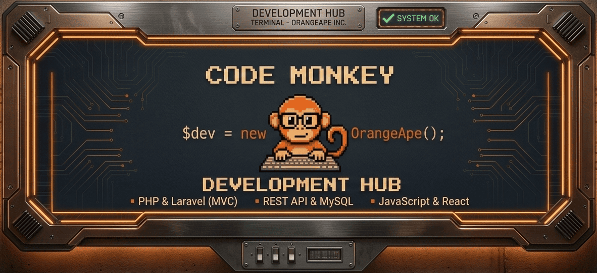

  

# Ciao! Sono Mirko Bechini 👋
### 🐒 Full Stack Web Developer | PHP & Laravel Enthusiast

Sono un Web Developer con la passione per il codice pulito e le architetture scalabili. Dopo un percorso intensivo in **Boolean**, sto approfondendo le mie conoscenze PHP e Laravel.

---

### 🛠 Il mio Stack Tecnologico

| Area | Tecnologie |
| :--- | :--- |
| **Backend** | PHP, Node.js |
| **Frontend** | HTML5, CSS3, JavaScript (ES6) |
| **Librerie e Framework** | Bootstrap, React, Laravel (MVC, Eloquent, API REST), Express |
| **Database** | MySQL |
| **Versioning** | Git, GitHub |
| **Tools** | NPM, Postman, Blade, VS Code, Google Gemini, Copilot |

---

### 🚀 Cosa sto combinando ultimamente?
- 🔭 Sto lavorando su: **CV Backoffice** (Sistema gestione flotta e manutenzioni) castato in Laravel. E al mio portfolio
- 🌱 Sto approfondendo: **React.js and AI Agents**
- ⚡ Fun fact: Sono più concentrato se c'è della musica Lo-Fi in sottofondo.

---

### 📫 Troviamoci!
- **LinkedIn:** [mirko-bechini-892202252](https://www.linkedin.com/in/mirko-bechini-892202252)
- **Email:** [mirkobechini@gmail.com](mailto:mirkobechini@gmail.com)

  <i>"Code is like humor. When you have to explain it, it’s bad."</i>

